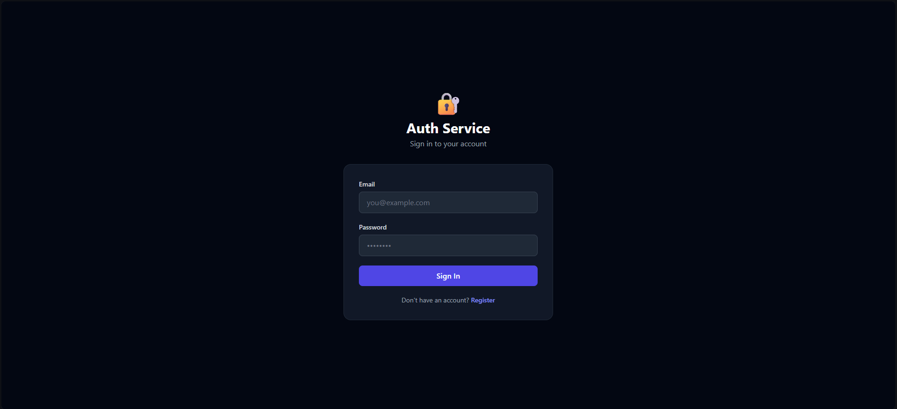
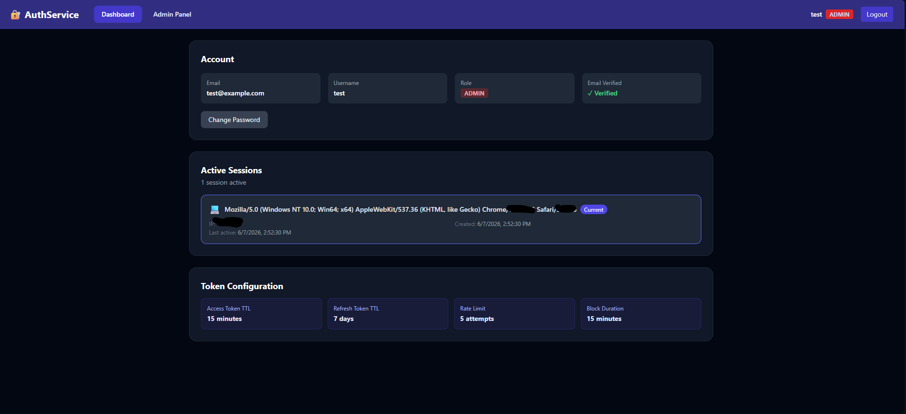
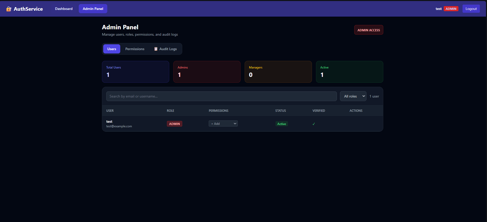
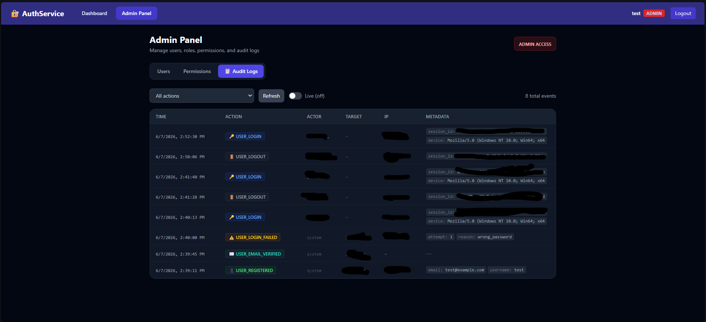
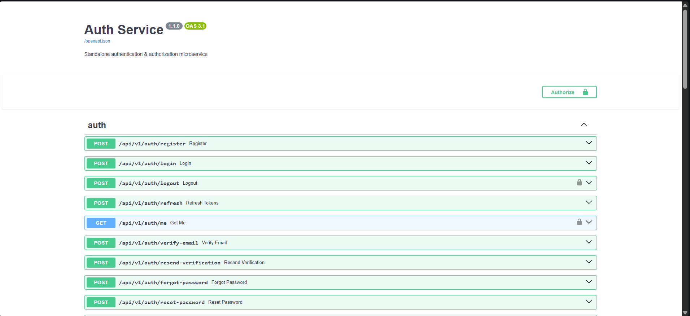

# 🔐 Auth Service

[](https://github.com/AdithyaRaoK14/Auth-Service/actions/workflows/ci.yml)
[](https://www.python.org/downloads/)
[](https://fastapi.tiangolo.com)
[](#)
[](#)

A production-grade standalone authentication microservice — a self-hosted mini Auth0.
Plug any app into it via REST for login, sessions, RBAC, and a full audit trail.

---

## Screenshots

### Login & Registration


### Session Dashboard
> View all active sessions, revoke individual devices, or logout everywhere at once.



### Admin Panel — User Management
> Inline role assignment, per-user permission grants, account enable/disable.



### Admin Panel — Audit Logs
> Every security-sensitive action logged with actor, target, IP, metadata, and timestamp.



### Swagger Docs (`/docs`)


---

## Resume Numbers

| Metric | Value |
|---|---|
| API endpoints | **26** |
| Passing tests | **71** |
| Access token TTL | **15 minutes** |
| Refresh token TTL | **7 days** |
| IP rate limit | **5 attempts → 15 min block** |
| Account lockout | **5 failures → 15 min lock** |
| Audit action types | **20** |
| Roles | **admin · manager · user** |
| Built-in permissions | **5 (read\_reports, write\_reports, delete\_users, manage\_billing, view\_audit\_log)** |

---

## Stack

| Layer | Tech |
|---|---|
| Backend | FastAPI + SQLAlchemy 2.0 async |
| Database | PostgreSQL 16 (asyncpg driver) |
| Cache / Sessions | Redis 7 |
| Auth | JWT (python-jose) + bcrypt |
| Frontend | React 18 + Vite + Tailwind CSS |
| Containerization | Docker + Docker Compose |
| CI | GitHub Actions |

---

## Quick Start

### Prerequisites
Docker + Docker Compose installed. That's it.

### 1. Clone and configure

```bash
git clone https://github.com/YOUR_USERNAME/auth-service.git
cd auth-service
cp .env.example backend/.env
```

Generate a real secret key and paste it into `backend/.env`:
```bash
python -c "import secrets; print(secrets.token_hex(32))"
# → paste as SECRET_KEY=...
```

### 2. Start everything

```bash
docker compose up --build
```

| Service | URL |
|---|---|
| **Frontend Dashboard** | http://localhost:3000 |
| **Backend API** | http://localhost:8000 |
| **Swagger UI** | http://localhost:8000/docs |
| **ReDoc** | http://localhost:8000/redoc |
| **Health check** | http://localhost:8000/health |

### 3. Create your first admin

Register at http://localhost:3000/register, then promote via psql:

```bash
docker compose exec db psql -U postgres -d authdb \
  -c "UPDATE users SET role = 'admin' WHERE email = 'your@email.com';"
```

Log back in — the **Admin Panel** tab appears automatically.

### 4. Run tests

No Docker needed. Uses SQLite + in-memory mock Redis.

```bash
cd backend
pip install -r requirements.txt
pytest
```

```
71 passed in ~47s
```

---

## API Reference

All endpoints live under `/api/v1/`.

### Auth — `/api/v1/auth`

| Method | Endpoint | Auth | Description |
|---|---|---|---|
| `POST` | `/auth/register` | — | Register; returns verification token |
| `POST` | `/auth/login` | — | Login; returns access + refresh pair |
| `POST` | `/auth/logout` | ✅ | Blacklist token, revoke session |
| `POST` | `/auth/refresh` | — | Rotate refresh token |
| `GET`  | `/auth/me` | ✅ | Current user info |
| `POST` | `/auth/verify-email` | — | Verify email with token |
| `POST` | `/auth/resend-verification` | — | New verification token |
| `POST` | `/auth/forgot-password` | — | Request password reset token |
| `POST` | `/auth/reset-password` | — | Reset with token |
| `POST` | `/auth/change-password` | ✅ | Change password (authenticated) |

### Sessions — `/api/v1/users`

| Method | Endpoint | Auth | Description |
|---|---|---|---|
| `GET`    | `/users/sessions` | ✅ | List all active sessions |
| `DELETE` | `/users/sessions/{id}` | ✅ | Revoke one session (one device) |
| `DELETE` | `/users/sessions` | ✅ | Revoke all *other* sessions |
| `DELETE` | `/users/sessions/all/force` | ✅ | Revoke all including current |

### Admin — `/api/v1/admin` *(admin role required)*

| Method | Endpoint | Description |
|---|---|---|
| `GET`    | `/admin/users` | List users — paginated, searchable, filterable by role |
| `GET`    | `/admin/users/{id}` | User detail with permissions |
| `PUT`    | `/admin/users/{id}/role` | Assign role |
| `PUT`    | `/admin/users/{id}/active` | Enable / disable account |
| `DELETE` | `/admin/users/{id}` | Delete user |
| `GET`    | `/admin/permissions` | List system permissions |
| `POST`   | `/admin/permissions` | Create permission |
| `POST`   | `/admin/users/{id}/permissions` | Grant permission to user |
| `DELETE` | `/admin/users/{id}/permissions/{name}` | Revoke permission |
| `GET`    | `/admin/audit-logs` | Paginated audit log (filter by action / actor / target) |
| `GET`    | `/admin/reports` | Demo endpoint requiring `read_reports` permission |

---

## Architecture & Key Concepts

### JWT Flow

```
POST /auth/login
  → create Session row (DB) + track in Redis
  → issue access_token (JWT, 15 min) + refresh_token (opaque, 7 days)

Authenticated request
  → Bearer access_token verified via SECRET_KEY
  → JTI checked against Redis blacklist

Access token expires
  → POST /auth/refresh  →  old refresh token revoked, new pair issued

POST /auth/logout
  → access_token JTI added to Redis blacklist (TTL = remaining expiry)
  → refresh_token revoked in DB
  → Session marked inactive
```

### Two-Layer Rate Limiting

```
Layer 1 — IP-based (defends against credential stuffing from one IP)
  5 failed logins from same IP  →  IP blocked for 15 min (Redis TTL key)
  Successful login resets counter

Layer 2 — Account-based (defends against distributed attacks across many IPs)
  5 wrong passwords for same account  →  account locked for 15 min (DB column)
  Successful login resets counter

Both layers are independent and complementary.
```

### Token Family & Reuse Detection

```
Login  →  new token_family_id (UUID) assigned
Rotate →  child token inherits same family_id

If a REVOKED token is presented:
  → _revoke_token_family() kills all tokens in the chain
  → all sessions from that login are deactivated
  → 401 "Token reuse detected" returned

This detects refresh token theft: the real user already rotated
the token, so if an attacker replays the old one, we know.
```

### RBAC + Permissions (two-layer authorization)

```python
# Layer 1 — role-based (coarse-grained)
# Implemented as a FastAPI Depends factory:
@router.delete("/users/{id}")
async def delete_user(admin: User = require_role("admin")):
    ...

# Layer 2 — permission-based (fine-grained)
# Admins bypass permission checks automatically.
@router.get("/reports")
async def view_reports(user: User = require_permission("read_reports")):
    ...
```

### Audit Log Design

- Every security-sensitive action inserts an `AuditLog` row **inside the same DB transaction** as the action itself — they commit atomically or both roll back.
- Rows are **never updated or deleted** — append-only.
- 20 action types: `USER_LOGIN`, `ACCOUNT_LOCKED`, `REFRESH_TOKEN_REUSE_DETECTED`, `ADMIN_ROLE_CHANGED`, `ADMIN_PERMISSION_GRANTED`, etc.

### Implementation Note: Commit-Before-Raise Pattern

FastAPI's `yield` dependency teardown calls `rollback()` when any exception propagates — including `HTTPException`. For security state that must survive a failed request (account lockout, token family revocation), the endpoint explicitly calls `await db.commit()` before raising:

```python
# Account lockout — must persist even though we're about to 401
user.account_locked_until = ...
await db.commit()          # ← commit BEFORE raise
raise HTTPException(403, "Account locked")

# Token reuse — family revocation must survive the 401 response
await _revoke_token_family(...)
await db.commit()          # ← commit BEFORE raise
raise HTTPException(401, "Token reuse detected")
```

This is a non-obvious production detail that comes up in security-focused code reviews.

---

## Project Structure

```
auth-service/
├── backend/
│   ├── app/
│   │   ├── config.py              # Pydantic settings (env-based)
│   │   ├── database.py            # SQLAlchemy async engine + session factory
│   │   ├── redis_client.py        # Redis async client
│   │   ├── dependencies.py        # require_role() · require_permission() · get_current_user()
│   │   ├── models/
│   │   │   └── user.py            # User · Session · RefreshToken · VerificationToken
│   │   │                          # Permission · UserPermission · AuditLog
│   │   ├── schemas/auth.py        # All Pydantic request/response schemas
│   │   ├── routers/
│   │   │   ├── auth.py            # Core auth (register · login · refresh · logout · …)
│   │   │   ├── users.py           # Session management
│   │   │   └── admin.py           # User/permission management · audit logs
│   │   └── services/
│   │       ├── token_service.py   # JWT · blacklist · IP rate limiting
│   │       ├── session_service.py # Session CRUD · token family rotation
│   │       └── audit_service.py   # Audit log writes + paginated reads
│   ├── tests/
│   │   ├── conftest.py            # SQLite + mock Redis fixtures
│   │   ├── test_auth.py           # 45 tests — auth flows · lockout · family reuse
│   │   ├── test_sessions.py       # 9 tests  — session CRUD · isolation
│   │   └── test_admin.py          # 17 tests — RBAC · permissions · audit log
│   ├── requirements.txt
│   ├── pytest.ini
│   └── Dockerfile
├── frontend/
│   └── src/
│       ├── pages/
│       │   ├── Login.jsx
│       │   ├── Register.jsx
│       │   ├── Dashboard.jsx       # Active sessions · change password · token config
│       │   └── AdminPanel.jsx      # Users tab · Permissions tab · Audit Logs tab
│       ├── components/
│       │   ├── Layout.jsx
│       │   └── AuditLogViewer.jsx  # Filterable · paginated · live-refresh
│       ├── api/client.js           # Axios + auto-refresh interceptor
│       └── context/AuthContext.jsx
├── docs/screenshots/               # ← drop your screenshots here
├── docker-compose.yml
├── .github/workflows/ci.yml
└── .env.example
```

---

## CI / GitHub Actions

The pipeline runs on every push to `main` / `develop` and every PR.

```
push → test (pytest + coverage) → lint (ruff) → docker-build check
```

**To activate the badge at the top of this file:**
1. Push to GitHub
2. Replace `YOUR_USERNAME` in the two badge URLs with your GitHub username

```
[](...)
```

---

## Environment Variables

| Variable | Default | Description |
|---|---|---|
| `SECRET_KEY` | *(required)* | JWT signing key — generate with `openssl rand -hex 32` |
| `DATABASE_URL` | `postgresql+asyncpg://...` | asyncpg connection string |
| `REDIS_URL` | `redis://redis:6379/0` | Redis connection |
| `ACCESS_TOKEN_EXPIRE_MINUTES` | `15` | Access token TTL |
| `REFRESH_TOKEN_EXPIRE_DAYS` | `7` | Refresh token TTL |
| `LOGIN_MAX_ATTEMPTS` | `5` | IP rate limit threshold |
| `LOGIN_BLOCK_SECONDS` | `900` | IP block duration |
| `ENVIRONMENT` | `development` | `development` or `production` |

---

## How to Add Screenshots

1. Run `docker compose up --build` and open the app
2. Take screenshots of: login page, dashboard (with sessions), admin users table, admin audit logs, Swagger UI
3. Save them to `docs/screenshots/` with these exact names:
   - `login.png`
   - `dashboard.png`
   - `admin-users.png`
   - `admin-audit.png`
   - `swagger.png`
4. `git add docs/screenshots/ && git commit -m "docs: add screenshots"`

The README already references these paths — images will appear automatically once the files exist.
